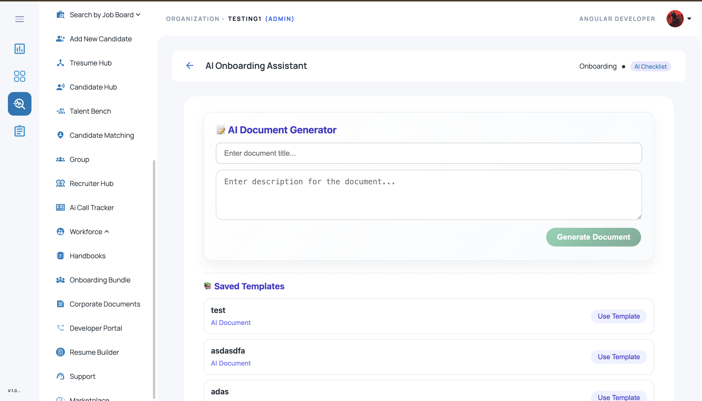
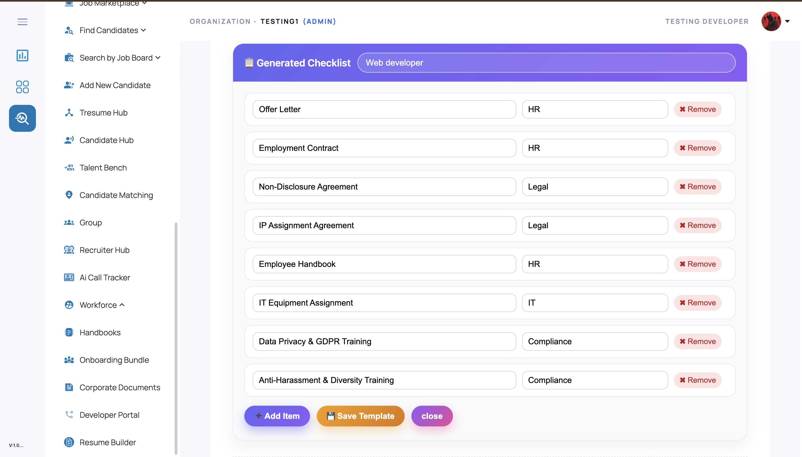
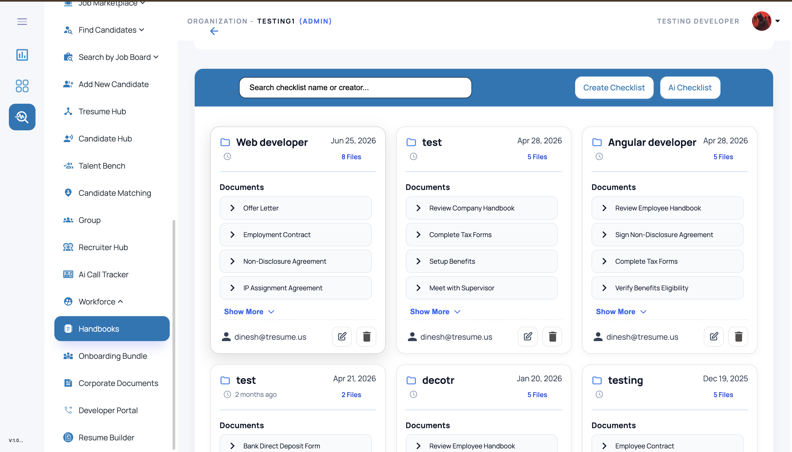

# AI Checklist Generator

An **AI-powered onboarding checklist and document generation module** built with **Angular**, **Node.js**, and **Microsoft SQL Server**.
This project helps HR / recruitment teams generate onboarding checklists and reusable document templates using AI-assisted workflows.

---

## 🚀 Overview

The **AI Checklist Generator** is designed to simplify onboarding preparation by automatically generating onboarding document checklists, reusable templates, and editable checklist items based on user input.

This module supports ATS / HRMS workflows by allowing recruiters or admins to:

* generate onboarding document templates using AI
* save reusable checklist templates
* reuse existing templates for similar job roles
* edit generated checklist items before finalizing
* manage onboarding documents in a structured workflow

The UI is built to support **real-world onboarding operations**, document planning, and recruiter productivity automation.

---

## ✨ Features

## 1) AI Document Generator

Generate onboarding documents / checklist templates by entering:

* document title
* onboarding description / prompt
* job-role-specific instructions

### Supported flow:

* enter a title
* provide onboarding or document description
* click **Generate Document**
* receive AI-generated onboarding checklist content

---

## 2) Saved Templates

* View previously saved checklist templates
* Reuse templates using **Use Template**
* Maintain role-based onboarding template library
* Quickly access commonly used onboarding document sets

---

## 3) Generated Checklist Editor

After AI generates the checklist, users can:

* review generated checklist items
* edit document names
* assign departments / categories
* remove unnecessary checklist items
* add new custom checklist items
* save the final template

---

## 4) Workflow Actions

* **Generate Document**
* **Use Template**
* **Add Item**
* **Remove Item**
* **Save Template**
* **Close / cancel editing**

---

## 🛠️ Tech Stack

### Frontend

* **Angular**
* **TypeScript**
* **HTML5**
* **SCSS / CSS**
* **Angular Material**

### Backend

* **Node.js**
* **Express.js**
* **AI API Integration** (OpenAI / Groq / LLM provider)

### Database

* **Microsoft SQL Server**

---

## 📂 Project Structure

```bash id="c4jv2m"
ai-checklist-generator/
│
├── frontend/                         # Angular application
│   ├── src/
│   │   ├── app/
│   │   │   ├── components/
│   │   │   │   └── ai-checklist-generator/
│   │   │   ├── services/
│   │   │   ├── models/
│   │   │   └── shared/
│   │   ├── assets/
│   │   └── environments/
│   └── angular.json
│
├── backend/                          # Node.js / Express backend
│   ├── routes/
│   ├── controllers/
│   ├── services/
│   ├── db/
│   ├── config/
│   └── server.js
│
├── database/
│   └── schema.sql
│
├── screenshots/
│   ├── ai-document-generator.png
│   ├── generated-checklist.png
│   └── saved-templates.png
│
└── README.md
```

---

## 🖥️ Core UI Screens

## 1. AI Document Generator

Allows users to:

* enter a document title
* provide onboarding description
* generate onboarding document / checklist content with AI

---

## 2. Saved Templates

Displays previously saved AI-generated templates with:

* template name
* document type
* quick **Use Template** action

---

## 3. Generated Checklist Editor

Displays AI-generated onboarding items in editable form:

* checklist item name
* department / category mapping
* remove action
* add item action
* save template action

---

## 📸 Screenshots

### AI Document Generator



### Generated Checklist Editor



### Saved Templates



> Create a folder named **`screenshots`** in the repo root and add your UI screenshots with these names:

* `ai-document-generator.png`
* `generated-checklist.png`
* `saved-templates.png`

---

## 🔄 Typical Workflow

1. Open **AI Onboarding Assistant**
2. Enter **document title**
3. Enter **document / onboarding description**
4. Click **Generate Document**
5. AI returns a checklist / onboarding document structure
6. Review generated checklist items
7. Edit or remove items if needed
8. Add additional manual checklist items
9. Save the checklist as a reusable template
10. Reuse saved templates later with **Use Template**

---

## 🧪 Example Generated Checklist JSON

```json id="tl55hx"
{
  "title": "Web Developer Onboarding Checklist",
  "items": [
    {
      "documentName": "Offer Letter",
      "department": "HR"
    },
    {
      "documentName": "Employment Contract",
      "department": "HR"
    },
    {
      "documentName": "Non-Disclosure Agreement",
      "department": "Legal"
    },
    {
      "documentName": "Employee Handbook",
      "department": "HR"
    },
    {
      "documentName": "IT Equipment Assignment",
      "department": "IT"
    }
  ]
}
```

---

## 🗄️ Example SQL Table Structure

### Checklist Templates Table

```sql id="ofxv8z"
CREATE TABLE ChecklistTemplates (
    TemplateId INT IDENTITY(1,1) PRIMARY KEY,
    Title NVARCHAR(200) NOT NULL,
    Description NVARCHAR(MAX),
    CreatedBy NVARCHAR(100),
    CreatedAt DATETIME DEFAULT GETDATE(),
    IsActive BIT DEFAULT 1
);
```

### Checklist Items Table

```sql id="ncd8px"
CREATE TABLE ChecklistTemplateItems (
    ItemId INT IDENTITY(1,1) PRIMARY KEY,
    TemplateId INT NOT NULL,
    DocumentName NVARCHAR(250) NOT NULL,
    Department NVARCHAR(100),
    FOREIGN KEY (TemplateId) REFERENCES ChecklistTemplates(TemplateId)
);
```

---

## ⚙️ Setup Instructions

## 1) Clone the repository

```bash id="53dsc8"
git clone https://github.com/YOUR-USERNAME/ai-checklist-generator.git
cd ai-checklist-generator
```

---

## 2) Frontend setup (Angular)

```bash id="cx88ht"
cd frontend
npm install
ng serve
```

Open in browser:

```bash id="2obafp"
http://localhost:4200
```

---

## 3) Backend setup (Node.js)

```bash id="o89u4f"
cd backend
npm install
npm start
```

---

## 4) Database setup (Microsoft SQL Server)

* Create a new SQL Server database
* Run the schema file inside the `database/` folder
* Update SQL connection config in backend

Example configuration:

```js id="b4n5m3"
const config = {
  user: "your_sql_username",
  password: "your_sql_password",
  server: "localhost",
  database: "AI_CHECKLIST_DB",
  options: {
    trustServerCertificate: true
  }
};
```

---

## 🔌 Example API Endpoints

Typical backend APIs for this module may include:

* `POST /api/checklist/generate` → generate checklist using AI
* `GET /api/checklist/templates` → fetch saved templates
* `POST /api/checklist/templates` → save checklist template
* `PUT /api/checklist/templates/:id` → update template
* `DELETE /api/checklist/templates/:id/item/:itemId` → remove checklist item

---

## 📈 Use Cases

This project can be used as a demo / reference implementation for:

* onboarding checklist automation
* ATS / HRMS onboarding workflows
* AI-based document template generation
* recruiter productivity tools
* reusable onboarding template systems

---

## 🔒 Important Note

This repository should be published as a **demo / showcase version** only.
Do **not** expose:

* production API keys
* OpenAI / Groq secret keys
* real employee / candidate data
* internal company template content
* private database credentials
* `.env` files containing secrets

Use **mock or sanitized data** for public GitHub uploads.

---

## 🚀 Future Improvements

* AI prompt templates by role / department
* drag-and-drop checklist item reordering
* template version history
* export checklist to PDF / Excel
* checklist assignment to candidates
* AI suggestion confidence / prompt history
* multilingual onboarding document generation
* checklist approval workflow

---

## 👨‍💻 Author

**Dinesh M**
Software Developer | Angular · Node.js · Microsoft SQL Server · ATS / HRMS · AI Automation

* GitHub: https://github.com/Dinesh-T-2005
* LinkedIn: https://www.linkedin.com/in/dinesh-m-a5698b330/
* Email: [dinesh996528@gmail.com](mailto:dinesh996528@gmail.com)

---

## 📄 License

This project is shared for learning, demonstration, and portfolio purposes.
